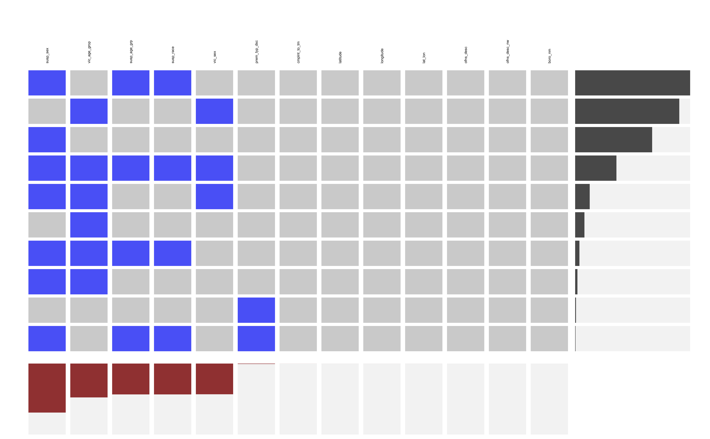

```{r setup, include=FALSE}
knitr::opts_chunk$set(echo = TRUE)
```

The github repository that this report is according to can be found here: https://github.com/Sandman-Larissa/Graphics_Final_Project.

## I. Data Introduction

We always receive emails regarding Crime Alert from Public Safety of Columbia University and safety definitely is our top priority. Thus, today we want to focus on the topics about Crime in New York City.

We are interested in if the crime rate depends on borough(Bronx, Manhattan, Brooklyn, Queens, Staten Island).Thus, we can know where is relatively safe to live and which area should be paid attention to when we walk in. Also, we want to study if there is a relationship between gender and certain crime types and if the time that the crime happened played an important role. Maybe we have to be especially careful at night than in daytime.

Crime is usually refered as action that constitutes an offense that is punishable by law. We always use the crime rate in a certain area to measure the safety level for that area. The common types of crime are assault, theft, rape, kidnapping and robbery. Researching on crime can help us to know it better and further prevents us from it.


## II. Description of the Data Source

### II.i Data Source

The data is published by NYC Open Data. The source link is: https://data.cityofnewyork.us/Public-Safety/NYPD-Complaint-Data-Current-Year-To-Date-/5uac-w243?category=Public-Safety&view_name=NYPD-Complaint-Data-Current-Year-To-Date-. It's provided by New York City Police Department (NYPD).

This is a breakdown of every criminal complaint report filed in NYC by the NYPD from 2016 to 2018. This data is manually extracted every quarter and reviewed by the Office of Management Analysis and Planning. Each record represents a criminal complaint in NYC and includes information abot the type of crime, the location and time of enforcement. In addition, information related to victim and suspect demographics is also included. This data can be used by the public to explore the nature of criminal activity. 

There are some other optinal dataset regarding to NYC crime, like CrimeReport(https://www.crimereports.com) or some other data published by NYC Open Data. As most of other datasets are based on this one, and the source of it is the most official，we finally chose it. 

### II.ii Basic Information about Column Variables
Here is the basic information about column variables:

```{r}
data_raw <- read.csv("../Data/raw/NYPD_Complaint_Data_Current__Year_To_Date_.csv")
# apply(data_raw, 2, summary)
```

| Column Names | Column Description | Type|
|----------------|---------------------------------------------------------------------|---------|
|CMPLNT_NUM|	Randomly generated persistent ID for each complaint | Number |
|ADDR_PCT_CD|	The precinct in which the incident occurred| Number|
|BORO_NM|	The name of the borough in which the incident occurred|Plain Text|
|CMPLNT_FR_DT|	Exact date of occurrence for the reported event (or starting date of occurrence, if CMPLNT_TO_DT exists)|Date & Time|
|CMPLNT_FR_TM|	Exact time of occurrence for the reported event (or starting time of occurrence, if CMPLNT_TO_TM exists)|Plain Text|
|CMPLNT_TO_DT|	Ending date of occurrence for the reported event, if exact time of occurrence is unknown|Date & Time|
|CMPLNT_TO_TM|	Ending time of occurrence for the reported event, if exact time of occurrence is unknown|Plain Text|
|CRM_ATPT_CPTD_CD|	Indicator of whether crime was successfully completed or attempted, but failed or was interrupted prematurely|Plain Text|
|HADEVELOPT|	Name of NYCHA housing development of occurrence, if applicable|Plain Text|
|HOUSING_PSA|	Development Level Code|Number|
|JURISDICTION_CODE|	Jurisdiction responsible for incident. Either internal, like Police(0), Transit(1), and Housing(2); or external(3), like Correction, Port Authority, etc.|Number|
|JURIS_DESC|	Description of the jurisdiction code|Plain Text|
|KY_CD|	Three digit offense classification code|Number|Plain Text|
|LAW_CAT_CD|	Level of offense: felony, misdemeanor, violation| Plain Text|
|LOC_OF_OCCUR_DESC|	Specific location of occurrence in or around the premises; inside, opposite of, front of, rear of|Plain Text|
|OFNS_DESC|	Description of offense corresponding with key code|Plain Text|
|PARKS_NM|	Name of NYC park, playground or greenspace of occurrence, if applicable (state parks are not included)|Plain Text|
|PATROL_BORO|	The name of the patrol borough in which the incident occurred|Plain Text|
|PD_CD|	Three digit internal classification code (more granular than Key Code)|Number|
|PD_DESC|	Description of internal classification corresponding with PD code (more granular than Offense Description)|Plain Text|
|PREM_TYP_DESC|	Specific description of premises; grocery store, residence, street, etc.|Plain Text|
|RPT_DT|	Date event was reported to police |Date & Time|
|STATION_NAME|	Transit station name|Plain Text|
|SUSP_AGE_GROUP|	Suspect’s Age Group|Plain Text|
|SUSP_RACE|	Suspect’s Race Description|Plain Text|
|SUSP_SEX|	Suspect’s Sex Description|Plain Text|
|TRANSIT_DISTRICT|	Transit district in which the offense occurred.|Number|
|VIC_AGE_GROUP|	Victim’s Age Group|Plain Text|
|VIC_RACE|	Victim’s Race Description|Plain Text|
|VIC_SEX|	Victim’s Sex Description|Plain Text|
|X_COORD_CD|	X-coordinate for New York State Plane Coordinate System, Long Island Zone, NAD 83, units feet (FIPS 3104)|Number|
|Y_COORD_CD|	Y-coordinate for New York State Plane Coordinate System, Long Island Zone, NAD 83, units feet (FIPS 3104)|Number|
|Latitude|	Midblock Latitude coordinate for Global Coordinate System, WGS 1984, decimal degrees (EPSG 4326) |Number|
|Longitude|	Midblock Longitude coordinate for Global Coordinate System, WGS 1984, decimal degrees (EPSG 4326)|Number|
|Lat_Lon|	Midblock coordinate for Global Coordinate System, WGS 1984, decimal degrees (EPSG 4326)|Location|

### II.iii Number of Records

```{r}
dim(data_raw)
```

Data has 464065 records and 35 features.

### II.iv Issues about the Data

Here are some issues about the data should be concerned or handled:

1. Information is accurate as of the date it was queried from the system of record, but should be considered a close approximation of current records, due to complaint revisions and updates.

2. Null values appearing frequently in certain fields may be attributed to changes on official department forms where data was previously not collected. Null values may also appear in instances where information was not available or unknown at the time of the report and should be considered as either “Unknown/Not Available/Not Reported.” We will analysis all the missing value in Part IV.

3. Crime complaints which involve multiple offenses are classified according to the most serious offense. Attempted crimes are recorded regardless of whether or not the criminal act was successful, except in the instance of Attempted Murder, which is recorded as Felony Assault.

4. There are usually three timestamps: *CMPLNT_FR_DT*, *CMPLNT_TO_DT*, *RPT_DT* are recorded for one complaint. When a complaint contains only a From Datetime, this represents the exact datetime when the crime incident was reported to occur. In the event a complaint has both a From Datetime and a To Datetime, a time range (rather than an exact time) was specified for the occurrence of the crime. In rare cases, records containing only a To Datetime indicate only a known endpoint to the crime.

5. To further protect victim identities, rape and sex crime offenses have been located as occurring at the police station house within the precinct of occurrence. Many other offenses that were not able to be geo-coded (for example, due to an invalid address) have been located as occurring at the police station house within the precinct of occurrence. This means that we cannot obtain the exact incident site for this kind of offenses.

6. Errors in data transcription may result in nominal data inconsistencies. We will check this kind of errors in Part III.

7. Some mala prohibita offenses do not require a complaint report and may not be represented accurately, or at all, in this dataset. These incidents are generally tracked using other Department forms, including arrests and summonses. These include (but are not limited to) certain drug, trespassing, theft of service, and prostitution offenses. And only valid complaints are included in this release. So the number of records contained in the data tends to be less than that of the crime in reality.

Please refer to the attached data files like footnotes for additional information about this dataset. These files can be found under the folder `Data/raw/`. https://github.com/Sandman-Larissa/Graphics_Final_Project/tree/master/Data/raw

## III. Description of data import / cleaning / transformation

There are some features that have repetitive information such as column `ADDR_PCT_CD` is the precinct in which the incident occurred and we've alreay have enough information about the location that the incident occurred, so we do not need it. Same thing for columns `X_COORD_CD` and `Y_COORD_CD`, we will just use latitude and longitude to locate the accurate position.

There are also some features that is irrevelent with what we want to research on such as `STATION_NAME`, `TRANSIT_DISTRICT`, and `LOC_OF_OCCUR_DESC`.So, we do not need include them.

```{r include=FALSE}
library(tidyverse)
data_reduction <- data_raw %>%
  select(-c(ADDR_PCT_CD, LOC_OF_OCCUR_DESC, STATION_NAME, TRANSIT_DISTRICT, X_COORD_CD, Y_COORD_CD))
head(data_reduction, 1)
```

The feature `KY_CD` and feature `OFNS_DESC` should be paired correspondingly, but we find some conflicts inside it such as below and the categories for OFNS_DESC is too specific.

```{r}
data_reduction[data_reduction$KY_CD==120, ]%>%
  group_by(KY_CD, OFNS_DESC) %>%
  summarize()
data_reduction[data_reduction$KY_CD==345, ]%>%
  group_by(KY_CD, OFNS_DESC) %>%
  summarize()
```

```{r results='hide'}
levels(data_reduction$OFNS_DESC)
```

We are going to add a new column `OFNS_DESC_NEW` that recategorize `OFNS_DESC` into more general categories and delete column `KY_CD`.

By the way, if you are interested in a particular crime type and do not know what is the meaning of it, you can check the website: http://ypdcrime.com/penal.law/.

```{r}
#data_reduction[data_reduction$OFNS_DESC == "CHILD ABANDONMENT/NON SUPPORT" || data_reduction$OFNS_DESC == "KIDNAPPING" || data_reduction$OFNS_DESC == "ENDAN WELFARE INCOMP"|| data_reduction$OFNS_DESC == "OFFENSES RELATED TO CHILDREN", ]
data_reduction$OFNS_DESC_NEW <- as.character(data_reduction$OFNS_DESC)
data_reduction$OFNS_DESC_NEW[data_reduction$OFNS_DESC == "CHILD ABANDONMENT/NON SUPPORT"] <- "KIDNAPPING & RELATED OFFENSES"
data_reduction$OFNS_DESC_NEW[data_reduction$OFNS_DESC == "KIDNAPPING"] <- "KIDNAPPING & RELATED OFFENSES"
data_reduction$OFNS_DESC_NEW[data_reduction$OFNS_DESC == "ENDAN WELFARE INCOMP"] <- "KIDNAPPING & RELATED OFFENSES"
data_reduction$OFNS_DESC_NEW[data_reduction$OFNS_DESC == "OFFENSES RELATED TO CHILDREN"] <- "KIDNAPPING & RELATED OFFENSES"

data_reduction$OFNS_DESC_NEW[data_reduction$OFNS_DESC == "OTHER OFFENSES RELATED TO THEF"] <- "OFFENSES RELATED TO THEF"
data_reduction$OFNS_DESC_NEW[data_reduction$OFNS_DESC == "THEFT OF SERVICES"] <- "OFFENSES RELATED TO THEF"
data_reduction$OFNS_DESC_NEW[data_reduction$OFNS_DESC == "POSSESSION OF STOLEN PROPERTY"] <- "OFFENSES RELATED TO THEF"
data_reduction$OFNS_DESC_NEW[data_reduction$OFNS_DESC == "THEFT-FRAUD"] <- "OFFENSES RELATED TO THEF"
data_reduction$OFNS_DESC_NEW[data_reduction$OFNS_DESC == "JOSTLING"] <- "OFFENSES RELATED TO THEF"

data_reduction$OFNS_DESC_NEW[data_reduction$OFNS_DESC == "INTOXICATED/IMPAIRED DRIVING"] <- "VEHICLE AND TRAFFIC LAWS"
data_reduction$OFNS_DESC_NEW[data_reduction$OFNS_DESC == "UNAUTHORIZED USE OF A VEHICLE"] <- "VEHICLE AND TRAFFIC LAWS"
data_reduction$OFNS_DESC_NEW[data_reduction$OFNS_DESC == "HOMICIDE-NEGLIGENT-VEHICLE"] <- "VEHICLE AND TRAFFIC LAWS"
data_reduction$OFNS_DESC_NEW[data_reduction$OFNS_DESC == "INTOXICATED & IMPAIRED DRIVING"] <- "VEHICLE AND TRAFFIC LAWS"

data_reduction$OFNS_DESC_NEW[data_reduction$OFNS_DESC == "OFF. AGNST PUB ORD SENSBLTY &"] <- "OFFENSES AGAINST PUBLIC ADMINI"
data_reduction$OFNS_DESC_NEW[data_reduction$OFNS_DESC == "OFFENSES AGAINST PUBLIC SAFETY"] <- "OFFENSES AGAINST PUBLIC ADMINI"
data_reduction$OFNS_DESC_NEW[data_reduction$OFNS_DESC == "PROSTITUTION & RELATED OFFENSES"] <- "SEX CRIMES AND RElATED"
data_reduction$OFNS_DESC_NEW[data_reduction$OFNS_DESC == "RAPE"] <- "SEX CRIMES AND RElATED"
data_reduction$OFNS_DESC_NEW[data_reduction$OFNS_DESC == "SEX CRIMES"] <- "SEX CRIMES AND RElATED"

data_reduction$OFNS_DESC_NEW[data_reduction$OFNS_DESC == "ADMINISTRATIVE CODE"] <- "UNCLASSIFIED STATE LAWS VIOLATION"
data_reduction$OFNS_DESC_NEW[data_reduction$OFNS_DESC == "DISORDERLY CONDUCT"] <- "UNCLASSIFIED STATE LAWS VIOLATION"
data_reduction$OFNS_DESC_NEW[data_reduction$OFNS_DESC == "CRIMINAL MISCHIEF & RELATED OF"] <- "UNCLASSIFIED STATE LAWS VIOLATION"
data_reduction$OFNS_DESC_NEW[data_reduction$OFNS_DESC == "NYS LAWS-UNCLASSIFIED FELONY"] <- "UNCLASSIFIED STATE LAWS VIOLATION"
data_reduction$OFNS_DESC_NEW[data_reduction$OFNS_DESC == "OTHER STATE LAWS (NON PENAL LA"] <- "UNCLASSIFIED STATE LAWS VIOLATION"
data_reduction$OFNS_DESC_NEW[data_reduction$OFNS_DESC == "MISCELLANEOUS PENAL LAW"] <- "UNCLASSIFIED STATE LAWS VIOLATION"
data_reduction$OFNS_DESC_NEW[data_reduction$OFNS_DESC == "NYS LAWS-UNCLASSIFIED VIOLATION"] <- "UNCLASSIFIED STATE LAWS VIOLATION"
data_reduction$OFNS_DESC_NEW[data_reduction$OFNS_DESC == "OTHER STATE LAWS"] <- "UNCLASSIFIED STATE LAWS VIOLATION"
data_reduction$OFNS_DESC_NEW[data_reduction$OFNS_DESC == "UNCLASSIFIED STATE LAWS VIOLATION"] <- "UNCLASSIFIED STATE LAWS VIOLATION"

data_reduction$OFNS_DESC_NEW[data_reduction$OFNS_DESC == "FRAUDULENT ACCOSTING"] <- "ECONOMIC CRIME"
data_reduction$OFNS_DESC_NEW[data_reduction$OFNS_DESC == "LOITERING/GAMBLING (CARDS, DIC"] <- "ECONOMIC CRIME"
data_reduction$OFNS_DESC_NEW[data_reduction$OFNS_DESC == "FRAUDS"] <- "ECONOMIC CRIME"
data_reduction$OFNS_DESC_NEW[data_reduction$OFNS_DESC == "OFFENSES INVOLVING FRAUD"] <- "ECONOMIC CRIME"
data_reduction$OFNS_DESC_NEW[data_reduction$OFNS_DESC == "GAMBLING"] <- "ECONOMIC CRIME"
data_reduction$OFNS_DESC_NEW[data_reduction$OFNS_DESC == "FORGERY"] <- "ECONOMIC CRIME"

data_reduction$OFNS_DESC_NEW[data_reduction$OFNS_DESC == "AGRICULTURE & MRKTS LAW-UNCLASSIFIED"] <- "CRIME RELATED TO HEALTH"
data_reduction$OFNS_DESC_NEW[data_reduction$OFNS_DESC == "DANGEROUS DRUGS"] <- "CRIME RELATED TO HEALTH"
data_reduction$OFNS_DESC_NEW[data_reduction$OFNS_DESC == "ALCOHOLIC BEVERAGE CONTROL LAW"] <- "CRIME RELATED TO HEALTH"
data_reduction$OFNS_DESC_NEW[data_reduction$OFNS_DESC == "NEW YORK CITY HEALTH CODE"] <- "CRIME RELATED TO HEALTH"

data_reduction$OFNS_DESC_NEW[data_reduction$OFNS_DESC == "UNLAWFUL POSS. WEAP. ON SCHOOL"] <- "WEAPON"
data_reduction$OFNS_DESC_NEW[data_reduction$OFNS_DESC == "DANGEROUS WEAPONS"] <- "WEAPON"

data_reduction$OFNS_DESC_NEW[data_reduction$OFNS_DESC == "ANTICIPATORY OFFENSES"] <- "OFFENSES AGAINST THE PERSON"
data_reduction$OFNS_DESC_NEW[data_reduction$OFNS_DESC == "ASSAULT 3 & RELATED OFFENSES"] <- "OFFENSES AGAINST THE PERSON"
data_reduction$OFNS_DESC_NEW[data_reduction$OFNS_DESC == "HARRASSMENT 2"] <- "OFFENSES AGAINST THE PERSON"
data_reduction$OFNS_DESC_NEW[data_reduction$OFNS_DESC == "FELONY ASSAULT"] <- "OFFENSES AGAINST THE PERSON"

data_reduction$OFNS_DESC_NEW[data_reduction$OFNS_DESC == "MURDER & NON-NEGL. MANSLAUGHTER"] <- "MURDER"
data_reduction$OFNS_DESC_NEW[data_reduction$OFNS_DESC == "HOMICIDE-NEGLIGENT,UNCLASSIFIE"] <- "WEAPON"

data_reduction$OFNS_DESC_NEW[data_reduction$OFNS_DESC == "BURGLARY"] <- "ROBBERY/BURGLARY/LARCENY"
data_reduction$OFNS_DESC_NEW[data_reduction$OFNS_DESC == "PETIT LARCENY"] <- "ROBBERY/BURGLARY/LARCENY"
data_reduction$OFNS_DESC_NEW[data_reduction$OFNS_DESC == "BURGLAR'S TOOLS"] <- "ROBBERY/BURGLARY/LARCENY"
data_reduction$OFNS_DESC_NEW[data_reduction$OFNS_DESC == "GRAND LARCENY"] <- "ROBBERY/BURGLARY/LARCENY"
data_reduction$OFNS_DESC_NEW[data_reduction$OFNS_DESC == "ROBBERY"] <- "ROBBERY/BURGLARY/LARCENY"
data_reduction$OFNS_DESC_NEW[data_reduction$OFNS_DESC == "PETIT LARCENY OF MOTOR VEHICLE"] <- "ROBBERY/BURGLARY/LARCENY"
data_reduction$OFNS_DESC_NEW[data_reduction$OFNS_DESC == "GRAND LARCENY OF MOTOR VEHICLE"] <- "ROBBERY/BURGLARY/LARCENY"
data_reduction$OFNS_DESC_NEW[data_reduction$OFNS_DESC == "CRIMINAL TRESPASS"] <- "ROBBERY/BURGLARY/LARCENY"
data_reduction$OFNS_DESC_NEW[data_reduction$OFNS_DESC == "ESCAPE 3"] <- "CRIMINAL ESCAPE"

# levels(as.factor(data_reduction$OFNS_DESC_NEW))
data_reduction <- data_reduction %>%
  select(-KY_CD)
```

There are some unreasonable values in columns `SUSP_AGE_GROUP`, `SUSP_SEX`, `VIC_AGE_GROUP`, `VIC_RACE`, `VIC_SEX` such as negative values in age, we decide to set them all to missing values.

```{r results='hide'}
levels(data_reduction$SUSP_AGE_GROUP)
levels(data_reduction$SUSP_SEX)
levels(data_reduction$VIC_AGE_GROUP)
levels(data_reduction$VIC_SEX)
```

```{r results='hide'}
# SUSP_AGE_GROUP
data_reduction$SUSP_AGE_GROUP <- as.character(data_reduction$SUSP_AGE_GROUP)
data_reduction[-which(data_reduction$SUSP_AGE_GROUP == "<18"| data_reduction$SUSP_AGE_GROUP == "18-24"| data_reduction$SUSP_AGE_GROUP == "25-44" | data_reduction$SUSP_AGE_GROUP == "45-64"| data_reduction$SUSP_AGE_GROUP == "65+"| data_reduction$SUSP_AGE_GROUP == "45-64"| data_reduction$SUSP_AGE_GROUP == "UNKNOWN"), ]$SUSP_AGE_GROUP <- NA
# SUSP_SEX
data_reduction$SUSP_SEX <- as.character(data_reduction$SUSP_SEX)
data_reduction[which(data_reduction$SUSP_SEX == "U"), ]$SUSP_SEX <- NA
# VIC_AGE_GROUP
data_reduction$VIC_AGE_GROUP <- as.character(data_reduction$VIC_AGE_GROUP)

data_reduction[-which(data_reduction$VIC_AGE_GROUP == "<18"| data_reduction$VIC_AGE_GROUP == "18-24"| data_reduction$VIC_AGE_GROUP == "25-44" | data_reduction$VIC_AGE_GROUP == "45-64"| data_reduction$VIC_AGE_GROUP == "65+"| data_reduction$VIC_AGE_GROUP == "45-64"| data_reduction$VIC_AGE_GROUP == ""), ]$VIC_AGE_GROUP <- NA

# VIC_SEX
data_reduction$VIC_SEX <- as.character(data_reduction$VIC_SEX)
data_reduction[which(data_reduction$VIC_SEX == "U"| data_reduction$VIC_SEX == "D"| data_reduction$VIC_SEX == "E"), ]$VIC_SEX <- NA

levels(as.factor(data_reduction$SUSP_AGE_GROUP))
levels(as.factor(data_reduction$SUSP_SEX))
levels(as.factor(data_reduction$VIC_AGE_GROUP))
levels(as.factor(data_reduction$VIC_SEX))
```

Finally, we only want to research on data from 2018 since the crime information before 2018 is very few and kind of out of date and maybe not useful for our research. After these cleaning and tidying, we still have 387354 records and 29 features.

```{r}
data_reduction$CMPLNT_FR_DT <- as.Date(as.character(data_reduction$CMPLNT_FR_DT), "%m/%d/%Y")
data_reduction$CMPLNT_TO_DT <- as.Date(as.character(data_reduction$CMPLNT_TO_DT), "%m/%d/%Y")
data_reduction <- data_reduction %>%
  filter(CMPLNT_FR_DT > "2018-01-01" & CMPLNT_FR_DT <"2018-12-31")%>%
  filter(CMPLNT_TO_DT > "2018-01-01" & CMPLNT_TO_DT <"2018-12-31")
dim(data_reduction)
head(data_reduction)
```

## IV. Analysis of Missing Values

As many missing informations in data are represented by "", we first convert all of them into NA.

```{r}
empty_to_na <- function(df){
  return(ifelse(df=="",NA, df))
}
data_includeNA <- as.data.frame(apply(data_reduction, 2, empty_to_na))
```

Then analyse missing values by column. The features having the five most missing values are shown as below.

```{r}
na_table <- function(df){
  table <- colSums(is.na(df)) %>% 
  sort(decreasing = TRUE) %>% 
  as.data.frame() %>%
  set_names(c("num")) %>% 
  rownames_to_column(var = "Feature") %>%
  filter(num > 0)
}
NA_table <- na_table(data_includeNA)
NA_table$portion <- NA_table$num/nrow(data_includeNA)
head(NA_table, 5)
```

As we can see that `PARKS_NM`, `HADEVELOPT`, and `HOUSING_PSA` have too many missing values whose portion is close to 1, which means we can hardly get useful information from them, we just remove these three features from data.

```{r}
data_includeNA[, c("PARKS_NM", "HADEVELOPT", "HOUSING_PSA")] <- list(NULL)
```

Then we use visna() to find the ten most common missing paterns.

```{r fig.height=8, fig.show='hide'}
data_onlyNA <- data_includeNA[-which(complete.cases(data_includeNA)==TRUE), NA_table$Feature[-c(1:3)]]
colnames(data_onlyNA) <- sapply(colnames(data_onlyNA), tolower)
extracat::visna(data_onlyNA, sort = "b", fr = 10)
```



In terms of the graph, we can find that the detail records about supspects and victims are the primary missing information. 

There are only three recods without `BORO_NM`. Acording to the GPS coordinate `Lat_Lon`, we can complement the names of borough where the crime happened manually.

```{r}
# data_includeNA[is.na(data_includeNA$BORO_NM),c("Lat_Lon")]
boro_nm_na <- is.na(data_includeNA$BORO_NM)
data_includeNA[is.na(data_includeNA$BORO_NM),c("BORO_NM")] <- c("MANHATTAN", "QUEENS", "BROOKLYN")
data_includeNA[boro_nm_na, c("Lat_Lon", "BORO_NM"), ]
```

For `CMPLNT_TO_TM`, we failed to find any commons among all missing records. Since we cannot deduce the true time when crime was completed, this feature was just removed from data. Similarly, the records whose `Latitude`, `Longitude`, `Lat_Lon`, `OFNS_DESC`, or `OFNS_DESC_NEW` are missing were deleted. For the rest of missing values, we choose to convert them into "UNKNOWN".

```{r}
head(data_includeNA[is.na(data_includeNA$CMPLNT_TO_TM),c("CMPLNT_FR_DT","CMPLNT_FR_TM","CMPLNT_TO_DT","RPT_DT")])
data_includeNA <- data_includeNA[-which(is.na(data_includeNA$Latitude) | is.na(data_includeNA$Longitude) | is.na(data_includeNA$OFNS_DESC) | is.na(data_includeNA$CMPLNT_TO_TM)),]

na_to_unkonwn <- function(df){
  df[is.na(df)] <- "UNKNOWN"
  return(df)
}
data_tidy <- as.data.frame(apply(data_includeNA, 2, na_to_unkonwn), stringsAsFactors = FALSE)
```

Finally we get the dataframe `data_tidy` by all above cleaning processes. The number of rows didn't change after deleting missing values by using na.omit(), which means there is no missing value in it.
```{r}
nrow(data_tidy) == nrow(na.omit(data_tidy))
write_csv(data_tidy, "../Data/tidy/NYC_crime_from_2016_to_2018.csv")
```

## V. Results

First, we want to explore if the suspect's age, crime's types, and suspect's gender have correlations with a crime and if the Victim's age, crime's types, and Victim's genders are related to a crime. Since all these variables are categories, we decide to plot mosaic to explore the relationships between them. There are lots of "UNKNOWN" values in suspect's age, suspect's gender, victim's age and victim's gender that is unhelpful here, so we just delete them for this plot.Because there are too many crime types to plot on mosaic plot. Then, we select 5 most popular crime type based on the frequecies each of them happened.
Finally, we have our mosaic plots.

By the way, the suspect's gender is a independent variable. We know it is better to place it at left edge vertically, but since other variables has much more vategoreis than gender. For better visialization, we put it in the position now it is.

```{r}
library(vcd)

data_tidy <- data_tidy[which(data_tidy$SUSP_SEX != "UNKNOWN"), ]
data_tidy <- data_tidy[which(data_tidy$SUSP_AGE_GROUP != "UNKNOWN"), ]

data_mosaic <- subset(data_tidy, OFNS_DESC_NEW == "OFFENSES AGAINST THE PERSON" | OFNS_DESC_NEW == "ROBBERY/BURGLARY/LARCENY"| OFNS_DESC_NEW == "UNCLASSIFIED STATE LAWS VIOLATION"| OFNS_DESC_NEW == "OFFENSES AGAINST PUBLIC ADMINI"| OFNS_DESC_NEW == "CRIME RELATED TO HEALTH")

sort(table(data_mosaic$OFNS_DESC_NEW), decreasing = TRUE)

data_mosaic$SUSP_SEX <- factor(data_mosaic$SUSP_SEX, levels = c("F", "M"))
data_mosaic$SUSP_AGE_GROUP <- factor(data_mosaic$SUSP_AGE_GROUP, levels = c("<18", "18-24", "25-44", "45-64", "65+"))
data_mosaic$OFNS_DESC_NEW <- factor(data_mosaic$OFNS_DESC_NEW, levels = c("OFFENSES AGAINST THE PERSON", "ROBBERY/BURGLARY/LARCENY", "UNCLASSIFIED STATE LAWS VIOLATION", "OFFENSES AGAINST PUBLIC ADMINI", "CRIME RELATED TO HEALTH"))
levels(data_mosaic$SUSP_SEX)
levels(data_mosaic$SUSP_AGE_GROUP)
levels(data_mosaic$OFNS_DESC_NEW)
levels(data_mosaic$BORO_NM)
icecreamcolors <- c("#ff99ff", "#cc9966")
subs_pal <- colorspace:: sequential_hcl(5, "Oslo")
snames <- list(set_varnames = c(SUSP_SEX="Suspect's Gender", SUSP_AGE_GROUP="Age Group for Suspect", OFNS_DESC_NEW="Crime Type"))
mosaic(SUSP_AGE_GROUP~ OFNS_DESC_NEW + SUSP_SEX, data = data_mosaic,
            direction = c("h", "h", "v"), labeling_args=snames, set_labels = list(OFNS_DESC_NEW = c("Assault","Rob","State","Pub","Health")),
            gp = gpar(fill = subs_pal))
```

In this mosaic plot, we can see for all kinds of crimes, the number of male suspects are pretty more than the number of female suspects. Also, the most likely age range for suspects are between 25 and 44. It is reasonable since the strength for people in this age range are strongest. In addition, the small lines between the corresponding sets of boxes almost align, which means the age range is independent with either suspect's gender and type of crimes.


```{r}
data_mosaic <- data_mosaic[which(data_mosaic$VIC_SEX != "UNKNOWN"), ]
data_mosaic <- data_mosaic[which(data_mosaic$VIC_AGE_GROUP != "UNKNOWN"), ]
data_mosaic$VIC_SEX <- factor(data_mosaic$VIC_SEX, levels = c("F", "M"))
data_mosaic$VIC_AGE_GROUP <- factor(data_mosaic$VIC_AGE_GROUP, levels = c("<18", "18-24", "25-44", "45-64", "65+"))
levels(data_mosaic$VIC_SEX)
levels(data_mosaic$VIC_AGE_GROUP)
vnames <- list(set_varnames = c(VIC_SEX="Victim's Gender", VIC_AGE_GROUP="Age Group for Victim", OFNS_DESC_NEW="Crime Type"))
mosaic(VIC_AGE_GROUP~ OFNS_DESC_NEW + VIC_SEX, data = data_mosaic,
            direction = c("h", "h", "v"), labeling_args=vnames, set_labels = list(OFNS_DESC_NEW = c("Assault","Rob","State","Pub","Health")),
            gp = gpar(fill = subs_pal))
```

Similar with the mosaic plot above, but here the number of female victims are pretty more than the number of male victims. It is common sense that females's strength are weaker than males' strength. So maybe suspects' always choose female victims to harm. The age range are pretty similar to the one for suspects. It is worth to note that for **ROBBERY/BURGLARY/LARCENY**, **UNCLASSIFIED STATE LAWS VIOLATION**,**CRIME RELATED TO HEALTH** three kinds of crimes, the small lines between the corresponding sets of boxes are not align, which indicates that the age ranges for victims are dependent on victim's gender on these kinds of crimes. Like the number of male victims who are robbed are much more than the number of female victims who are robbed who under 18 years old.

```{r}
library(lubridate)
data_time <- data_tidy
head(data_time$CMPLNT_FR_DT)
data_time$CMPLNT_FR_DT <- as.Date(as.character(data_time$CMPLNT_FR_DT), "%Y-%m-%d")
data_time$num_of_crime <- rep(1, nrow(data_time))
#data_time %>%
#    group_by(Week = week(CMPLNT_FR_DT)) %>%
#    count(OFNS_DESC_NEW)
weekly <- data_time %>%
    group_by(Year = year(CMPLNT_FR_DT),
             Week = week(CMPLNT_FR_DT)) %>%
  summarize(WeeklyCrime = sum(num_of_crime)) %>%
    mutate(Date = as.Date("2018-01-01") +
               365*(Year - 2018) +
               7*(Week -1))
ggplot(data_time, aes(CMPLNT_FR_DT, num_of_crime)) +
    geom_line(color = "grey30") +
    geom_line(data = weekly,
              aes(Date, WeeklyCrime),
              color = "blue", lwd = 1) +
    scale_x_date(date_labels = "%b\n%Y") +
    ylab("number of crime)") +
    xlab("") +
    theme_bw(16)
```


Then, we want to explore the trend of number of crimes for different type of crimes with time.

```{r}
library(lubridate)
data_time <- data_tidy
head(data_time$CMPLNT_FR_DT)
data_time$CMPLNT_FR_DT <- as.Date(as.character(data_time$CMPLNT_FR_DT), "%Y-%m-%d")
data_time$num_of_crime <- rep(1, nrow(data_time))
#data_time %>%
#    group_by(Week = week(CMPLNT_FR_DT)) %>%
#    count(OFNS_DESC_NEW)
weeklyAssult <- data_time %>%
    filter(OFNS_DESC_NEW == "OFFENSES AGAINST THE PERSON") %>%
    group_by(Year = year(CMPLNT_FR_DT),
             Week = week(CMPLNT_FR_DT)) %>%
    summarize(WeeklyCrime = sum(num_of_crime)) %>%
    mutate(Date = as.Date("2018-01-01") +
               365*(Year - 2018) +
               7*(Week -1))
weeklyRob <- data_time %>%
    filter(OFNS_DESC_NEW == "ROBBERY/BURGLARY/LARCENY") %>%
    group_by(Year = year(CMPLNT_FR_DT),
             Week = week(CMPLNT_FR_DT)) %>%
    summarize(WeeklyCrime = sum(num_of_crime)) %>%
    mutate(Date = as.Date("2018-01-01") +
               365*(Year - 2018) +
               7*(Week -1))
weeklyState <- data_time %>%
    filter(OFNS_DESC_NEW == "UNCLASSIFIED STATE LAWS VIOLATION") %>%
    group_by(Year = year(CMPLNT_FR_DT),
             Week = week(CMPLNT_FR_DT)) %>%
    summarize(WeeklyCrime = sum(num_of_crime)) %>%
    mutate(Date = as.Date("2018-01-01") +
               365*(Year - 2018) +
               7*(Week -1))
weeklyPublic <- data_time %>%
    filter(OFNS_DESC_NEW == "OFFENSES AGAINST PUBLIC ADMINI") %>%
    group_by(Year = year(CMPLNT_FR_DT),
             Week = week(CMPLNT_FR_DT)) %>%
    summarize(WeeklyCrime = sum(num_of_crime)) %>%
    mutate(Date = as.Date("2018-01-01") +
               365*(Year - 2018) +
               7*(Week -1))
weeklyHealth <- data_time %>%
    filter(OFNS_DESC_NEW == "CRIME RELATED TO HEALTH") %>%
    group_by(Year = year(CMPLNT_FR_DT),
             Week = week(CMPLNT_FR_DT)) %>%
    summarize(WeeklyCrime = sum(num_of_crime)) %>%
    mutate(Date = as.Date("2018-01-01") +
               365*(Year - 2018) +
               7*(Week -1))
ggplot(data_time, aes(CMPLNT_FR_DT, num_of_crime)) +
    geom_line(color = "grey30") +
    geom_line(data = weeklyAssult,
              aes(Date, WeeklyCrime),
              color = "yellow", lwd = 0.5) +
    geom_line(data = weeklyRob,
              aes(Date, WeeklyCrime),
              color = "red", lwd = 0.5) +
    geom_line(data = weeklyState,
              aes(Date, WeeklyCrime),
              color = "grey", lwd = 0.5) +
    geom_line(data = weeklyPublic,
              aes(Date, WeeklyCrime),
              color = "skyblue", lwd = 0.5) +
    geom_line(data = weeklyHealth,
              aes(Date, WeeklyCrime),
              color = "green", lwd = 0.5) +
    scale_x_date(date_labels = "%b\n%Y") + 
    ylab("number of crimes") +
    xlab("") +
    theme_bw(16)
```

In the plot, it seems like that there is a sharp increasing of number of crimes in the beginning of 2018 for all kinds of crimes. Then all lines fluctuate a little bit in the middle and finally there seems have a smooth decreasing at the end of 2018.


To show the trends of different boroughs, we choose to use parcoords plot.

```{r}
library(dplyr)
library(parcoords)

data_p <- data_mosaic
data_Type <- data_p %>%
  count(OFNS_DESC_NEW, BORO_NM) %>%
  group_by(OFNS_DESC_NEW,BORO_NM) %>%
  spread(key = OFNS_DESC_NEW, value = n)
colnames(data_Type) <- c("BORO_NM", "Assult","Rob","State","Pub","Health")

data_p$num_of_crime <- rep(1, nrow(data_p))
total_male = length(which(data_p$SUSP_SEX == "M")) 

Male_ratio <- data_p %>%
  group_by(BORO_NM) %>%
  filter(SUSP_SEX == "M") %>%
  summarize(M_ratio = sum(num_of_crime)/total_male)

data_p$time <- round(as.numeric(hms(data_p$CMPLNT_FR_TM))/3600)

time_period <- data_p %>%
  count(time, BORO_NM) %>%
  group_by(BORO_NM) %>%
  filter(n == max(n)) %>%
  select(time)

data_par <- full_join(data_Type, Male_ratio)
data_parc <- full_join(data_par, time_period)

Total_num_crime <- data_p %>%
  group_by(BORO_NM) %>%
  summarize(Total_num_crime = sum(num_of_crime))

data_parcoord <- full_join(data_parc, Total_num_crime)

data_parcoord %>% arrange(Total_num_crime) %>%
  parcoords(
    rownames = F 
    , brushMode = "1D-axes"
    , reorderable = T
    , queue = T
    , alpha = 0.8
    , color = list(
      colorBy = "BORO_NM"
      , colorScale = htmlwidgets::JS("d3.scale.category10()")
    )
  )
```

From this plot, we discover Brooklyn  and Queen Boroughs are relatively dangerous and Staten Island is relatively safe. The most common crime types in Manhattan are **ROBBERY/BURGLARY/LARCENY** and **OFFENSES AGAINST PUBLIC ADMINI**.

Finally, to research on the relationships on Suspect's Races for number of crimes of all different kinds of crime types, we choose to use cleveland plot.

```{r}
data_Cleveland <- data_tidy %>%
  count(SUSP_RACE, OFNS_DESC_NEW) %>%
  group_by(SUSP_RACE,OFNS_DESC_NEW)
colnames(data_Cleveland) <- c("Race", "Crime_Type", "num_of_crime")
theme_dotplot <- theme_bw(16) +
    theme(axis.text.y = element_text(size = rel(.75)),
          axis.ticks.y = element_blank(),
          axis.title.x = element_text(size = rel(.75)),
          panel.grid.major.x = element_blank(),
          panel.grid.major.y = element_line(size = 0.5),
          panel.grid.minor.x = element_blank())

ggplot(data_Cleveland, aes(x = num_of_crime, y = fct_reorder2(Crime_Type, fct_relevel(Race, "BLACK", after = Inf), -num_of_crime))) +
    theme_dotplot + 
    geom_point(aes(col = Race)) +
    labs(x = "number of Crime", y = "Type of Crime") +
    ggtitle("number for different type of Crimes") + 
    scale_color_discrete(name="Race",
                         breaks=c("AMERICAN INDIAN/ALASKAN NATIVE", "ASIAN / PACIFIC ISLANDER", "BLACK", "BLACK HISPANIC", "UNKNOWN", "WHITE", "WHITE HISPANIC"),
                         labels=c("Amer Ind/Ala", "Asi/Pac", "Black", "B Hisp", "UNKNOWN", "WHITE", "W Hisp"))
```

It seems like that for some dangerous crimes such as **ROBBERY/BURGLARY/LARCENY** and **OFFENSES AGAINST THE PERSON** and **WEAPON**, those suspects whose races are most likely black.

## VI. Interactive component

### VI.i NYC Crime Map

We used shiny and leaflet to build up a crime map which shows all primary information of NYC crime in 2018. In our Crime Map Web, you can filter the time range, borough range, and so on to find the distribution and detail information of crime event.

https://sandman-larissa.shinyapps.io/CrimeMap/

### VI.ii Guess

This part we build a website to let users make interesting guess about NYC crime.
https://bl.ocks.org/Sandman-Larissa/8e6e2960ac28511668846abb2c2110ee

## VII. Conclusion